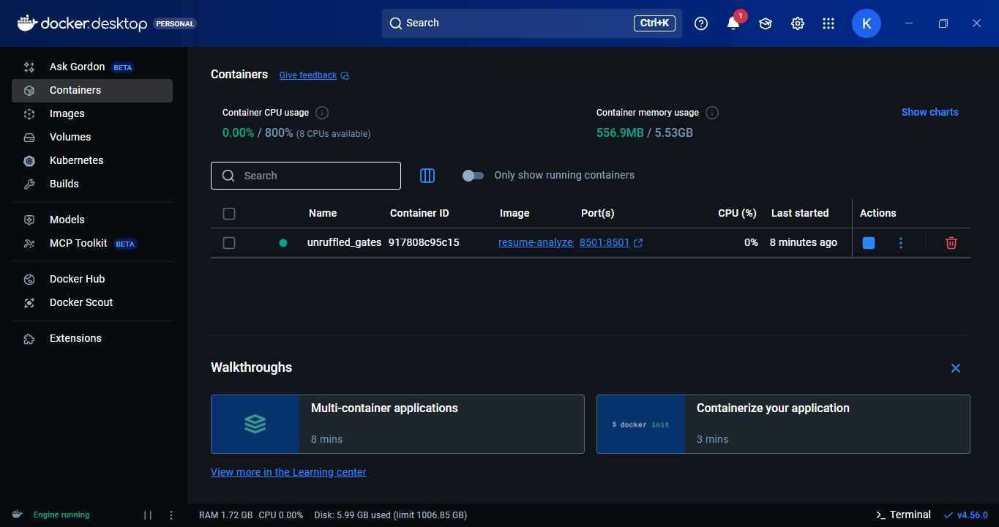

# 🚀 Phase 1 (NLP Keyword Matching) ✅
  
> *A resume analysis tool that uses Natural Language Processing (NLTK) to clean, lemmatize, and match resumes against Job Descriptions.*


# 🤖 Phase 2 (Semantic Search & Explainability) ✅

> *A Next-Gen ATS Simulator that uses Deep Learning (SBERT Transformers) to understand the **meaning** of a resume, not just keywords.*


# 🐳 **Current Status:** Phase 3 (Containerized Microservice) ✅
  
> *A Production-Ready ATS Simulator. Containerized with Docker for "Run Anywhere" deployment, featuring Semantic Search and AI-Powered Explainability.*



## 📌 Project Overview
Most ATS (Applicant Tracking Systems) reject qualified candidates because they lack specific keywords.

Unlike basic keyword matchers that fail on simple word variations (e.g., "Analyze" vs. "Analysis"), this **Phase 1** implementation integrates an **NLP Pipeline** to normalize text before matching. It identifies the gap between a candidate's resume and the job requirements using mathematical vectorization.

In **Phase 2**, we upgraded from simple keyword matching to **Semantic Understanding**. By integrating **BERT-based Transformers**, this tool now understands that *"Building Dashboards"* is semantically similar to *"Data Visualization"*, identifying qualified candidates even if they don't use the exact phrasing of the Job Description (JD).

The **Phase 3**, project is an **Engineering-Grade ATS Simulator** that evolves beyond simple scripts. It uses **Deep Learning (Transformers)** to understand the semantic meaning of a resume and is deployed as a **Dockerized Microservice**, ensuring it runs consistently on any machine (Local, AWS, Azure, etc.).

## 🛠️ Tech Stack
* **Deployment:** Docker & Docker Compose (Containerization).
* **Intelligence:** Sentence-Transformers (SBERT) & PyTorch (CPU-Optimized).
* **NLP Pipeline:** NLTK for text preprocessing and Lemmatization.
* **Frontend:** Streamlit.
* **Core Logic:** Hybrid Search (Cosine Similarity + Keyword Gap Analysis).

## ✨ Key Features
* **🐳 Portable & Scalable:** Fully containerized. No "it works on my machine" issues—just pull the image and run.
* **🧠 Semantic Scoring:** Uses `all-MiniLM-L6-v2` to understand that "React" and "Frontend Development" are related.
* **⚡ Instant Startup:** Uses **Docker Layer Caching** to pre-bake heavy AI models (80MB+) into the image, so the app launches instantly.
* **🔍 Explainability:** Highlights the "Hero Sentences" that contributed most to your match score.

## 📂 Project Structure
```text
resume-analyzer/
│
├── src/
│   ├── parser.py       # Handles PDF/DOCX extraction
│   ├── cleaner.py      # NLTK Pipeline (Lemmatization & Cleaning)
│   └── analyzer.py     # Core logic (Cosine Similarity)
|── Dockerfile          # Container instructions (Multi-layer build)
├── .dockerignore       # Build context optimization
├── app.py              # Main Streamlit Interface
├── requirements.txt    # Dependencies
└── README.md           # Documentation
```
🚀 How to Run

--> Since this is Dockerized, you don't need to install Python or libraries manually.

Option 1: Run with Docker (Recommended)
1. Build the Image
```
docker build -t resume-analyzer .
```
Note: The build process automatically downloads the AI models, so they are "baked in" to the container.

2. Run the Container
```
docker run -p 8501:8501 resume-analyzer
```
3. Access App Open your browser to ``` http://localhost:8501 ```

🚀 Option 2: Run Locally
1. Clone the Repository
```bash
git clone https://github.com/kanishk2705/Smart-Resume-Analyzer.git
cd resume-analyzer
```
2. Install Dependencies
```bash
pip install -r requirements.txt
```
3. Run the Application
```bash
streamlit run app.py
```
4. Usage
```bash
    . Upload your Resume (PDF or DOCX).
    . Paste the Job Description.
    . Click "Analyze" to see your score and missing keywords.
```
🗺️ Engineering Roadmap

This project follows an iterative engineering path, moving from basic scripts to a production-grade AI application.

[x] Phase 1: NLP-Enhanced Matcher - Implemented NLTK pipeline for robust keyword matching.

[x] Phase 2: The Intelligence Layer - Integrating BERT/SBERT Transformers for Semantic Context.

[x] Phase 3: DevOps & Scalability - Dockerizing the application for portable deployment.

[ ] Phase 4: GenAI Mentor - Using LLMs (Gemini) to generate custom learning paths.

Built by A C KANISHK as part of an end-to-end Machine Learning Engineering study.