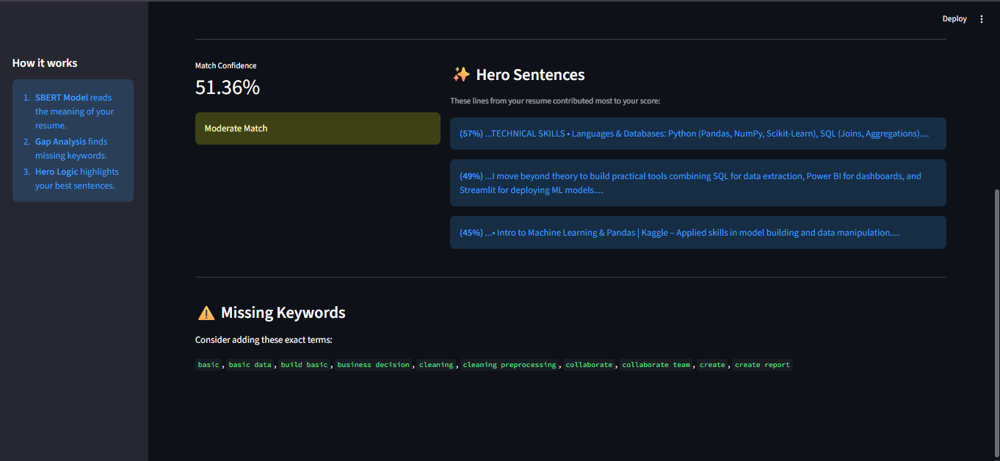

# 🚀 Smart Resume Analyzer (Phase 1: NLP-Enhanced)

> Phase 1 (NLP Keyword Matching) ✅  
> *A resume analysis tool that uses Natural Language Processing (NLTK) to clean, lemmatize, and match resumes against Job Descriptions.*


# 🤖 Smart Resume Analyzer (Phase 2: AI-Powered)

> **Current Status:** Phase 2 (Semantic Search & Explainability) ✅  
> *A Next-Gen ATS Simulator that uses Deep Learning (SBERT Transformers) to understand the **meaning** of a resume, not just keywords.*



## 📌 Project Overview
Most ATS (Applicant Tracking Systems) reject qualified candidates because they lack specific keywords.

Unlike basic keyword matchers that fail on simple word variations (e.g., "Analyze" vs. "Analysis"), this **Phase 1** implementation integrates an **NLP Pipeline** to normalize text before matching. It identifies the gap between a candidate's resume and the job requirements using mathematical vectorization.

In **Phase 2**, we upgraded from simple keyword matching to **Semantic Understanding**. By integrating **BERT-based Transformers**, this tool now understands that *"Building Dashboards"* is semantically similar to *"Data Visualization"*, identifying qualified candidates even if they don't use the exact phrasing of the Job Description (JD).

## 🛠️ Tech Stack
* **Python 3.10+**
* **Sentence-Transformers (SBERT):** Uses `all-MiniLM-L6-v2` to convert text into high-dimensional vector embeddings.
* **PyTorch:** The backend engine driving the Transformer model.
* **NLTK:** For sentence segmentation and text preprocessing.
* **Streamlit:** Interactive UI.
* **Scikit-Learn:** For supplementary keyword gap analysis.

## ✨ Key Features
* **🧠 Semantic Scoring:** Uses Deep Learning to calculate a match score based on *context* and *meaning*, rather than just word counts.
* **🔦 Hero Sentence Logic:** Automatically highlights the specific lines in your resume that contributed most to your score (Explainability).
* **📉 Gap Analysis:** Still tracks missing hard skills (keywords) to ensure you pass strict ATS filters.
* **⚡ Hybrid Architecture:** Combines Semantic Search (for the score) with Keyword Search (for the feedback).

## 📂 Project Structure
```text
resume-analyzer/
│
├── src/
│   ├── parser.py       # Handles PDF/DOCX extraction
│   ├── cleaner.py      # NLTK Pipeline (Lemmatization & Cleaning)
│   └── analyzer.py     # Core logic (Cosine Similarity)
│
├── app.py              # Main Streamlit Interface
├── requirements.txt    # Dependencies
└── README.md           # Documentation
```
🚀 How to Run Locally
1. Clone the Repository
```bash
git clone https://github.com/kanishk2705/Smart-Resume-Analyzer.git
cd resume-analyzer
```
2. Install Dependencies
```bash
pip install -r requirements.txt
```
3. Run the Application
```bash
streamlit run app.py
```
4. Usage
```bash
    . Upload your Resume (PDF or DOCX).

    . Paste the Job Description.

    . Click "Analyze" to see your score and missing keywords.
```
🗺️ Engineering Roadmap

This project follows an iterative engineering path, moving from basic scripts to a production-grade AI application.

[x] Phase 1: NLP-Enhanced Matcher - Implemented NLTK pipeline for robust keyword matching.

[x] Phase 2: The Intelligence Layer - Integrating BERT/SBERT Transformers for Semantic Context.

[ ] Phase 3: DevOps & Scalability - Dockerizing the application for portable deployment.

[ ] Phase 4: GenAI Mentor - Using LLMs (Gemini) to generate custom learning paths.

Built by A C KANISHK as part of an end-to-end Machine Learning Engineering study.