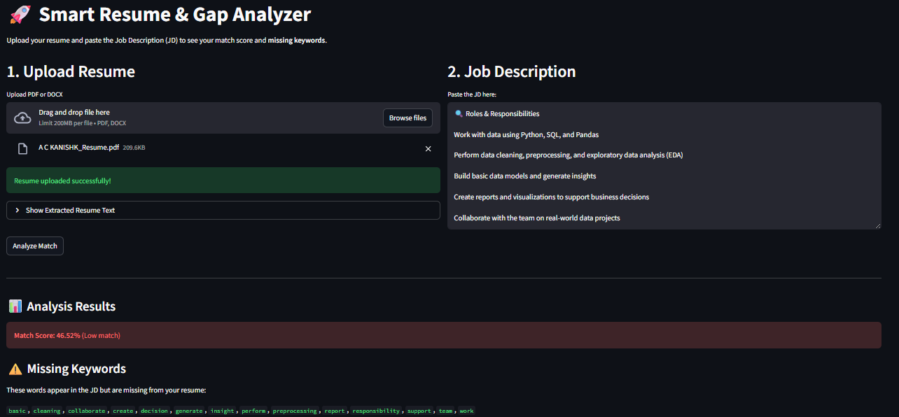

# 🚀 Smart Resume Analyzer (Phase 1: NLP-Enhanced)

> **Current Status:** Phase 1 (NLP Keyword Matching) ✅  
> *A resume analysis tool that uses Natural Language Processing (NLTK) to clean, lemmatize, and match resumes against Job Descriptions.*



## 📌 Project Overview
This project is an **ATS (Application Tracking System) Simulator**. 

Unlike basic keyword matchers that fail on simple word variations (e.g., "Analyze" vs. "Analysis"), this **Phase 1** implementation integrates an **NLP Pipeline** to normalize text before matching. It identifies the gap between a candidate's resume and the job requirements using mathematical vectorization.

## 🛠️ Tech Stack (Phase 1)
* **Python 3.10+**
* **Streamlit:** For the interactive web interface.
* **NLTK (Natural Language Toolkit):** For intelligent text preprocessing (Tokenization, Lemmatization, Stopword Removal).
* **Scikit-Learn:** For `CountVectorizer` and `CosineSimilarity`.
* **PyPDF & Python-Docx:** For robust file parsing.

## ✨ Features
* **Intelligent Text Cleaning:** Uses **NLTK Lemmatization** to convert words to their root form (e.g., "Developing" $\rightarrow$ "Develop") for accurate matching.
* **Stopword Removal:** Filters out common noise words ("the", "and", "is") to focus on skills.
* **Math-Based Matching:** Uses **Cosine Similarity** to calculate the angle between the Resume vector and JD vector.
* **Gap Analysis:** Identifies specific keywords present in the JD that are missing from the resume.

## ⚠️ Current Limitations (Why we need Phase 2)
While Phase 1 handles word variations well, it still relies on **Keyword Presence**.
* *Limitation:* It does not understand **Context**. 
    * *Example:* If the JD asks for "Data Visualization" and you have "Tableau" (but not the exact words "Data Visualization"), it might score you lower.
* *Next Step:* **Phase 2** will introduce **Deep Learning (Sentence-BERT Transformers)** to understand that "Tableau" *implies* "Data Visualization."

## 📂 Project Structure
```text
resume-analyzer/
│
├── src/
│   ├── parser.py       # Handles PDF/DOCX extraction
│   ├── cleaner.py      # NLTK Pipeline (Lemmatization & Cleaning)
│   └── analyzer.py     # Core logic (Cosine Similarity)
│
├── app.py              # Main Streamlit Interface
├── requirements.txt    # Dependencies
└── README.md           # Documentation

🚀 How to Run Locally
1. Clone the Repository
```bash
git clone <your-repo-url>
cd resume-analyzer
```
2. Install Dependencies
```bash
pip install -r requirements.txt
```
3. Run the Application
```bash
streamlit run app.py
```
4. Usage
```bash
    . Upload your Resume (PDF or DOCX).

    . Paste the Job Description.

    . Click "Analyze" to see your score and missing keywords.
```
🗺️ Engineering Roadmap

This project follows an iterative engineering path, moving from basic scripts to a production-grade AI application.

[x] Phase 1: NLP-Enhanced Matcher - Implemented NLTK pipeline for robust keyword matching.

[ ] Phase 2: The Intelligence Layer - Integrating BERT/SBERT Transformers for Semantic Context.

[ ] Phase 3: DevOps & Scalability - Dockerizing the application for portable deployment.

[ ] Phase 4: GenAI Mentor - Using LLMs (Gemini) to generate custom learning paths.

Built by A C KANISHK as part of an end-to-end Machine Learning Engineering study.